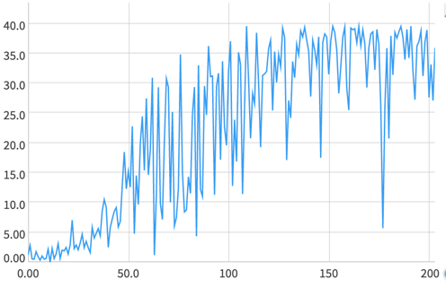

# rl-continuous-control
This repository is a solution to problem posed in RL nanodegree - controlling a robotic arm to move in a 3D space.
The details of the problem are in the [nanodegree repository](https://github.com/udacity/deep-reinforcement-learning)
in the [p2 navigation folder](https://github.com/udacity/deep-reinforcement-learning/tree/master/p2_continuous-control)

## Problem description
The problem exists in two versions. Both of these work in a [Reacher Unity Environment](https://github.com/Unity-Technologies/ml-agents/blob/master/docs/Learning-Environment-Examples.md#reacher)
The aims is to control a robot arm to be in contact with a sphere for as long as possible. The versions of the environemnt are:
 * Single agent - where one arm is controlled 
 * Multiple agent - where 20 arms and 20 spheres are present.  

The gif below shows how the multiple agent version looks like  


### Action range
The agent is controlled by 4 *continous* variables, which corresponds to torque applied to joints of the arm

### Rewards
The agent gets a reward of `+0.1` for each step when the agent's arm is in contact with a goal sphere


### State Space
The agent doesn't observe the environment directly (that is, by using observing the raw pixel data).
Instead, every state (so, every position in the environment) provides data about the agents environment in a form of
33 continuous variables. These variables represent position, rotation, velocity and angular velocity of the agent and
the goal.

### Objective
The overall goal of the project is to achieve an *average score of 30 over 100 consecutive episodes*. In case of this 
repository, the final result is achieved after 175 epochs

## Learning Process 
The learning process was monitored using the neptune.ai service, with details regarding the final experiment provided 
under [this link](https://app.neptune.ai/wsz/RL-AgentCritic/e/RLAG-51/charts). 

The plot showing average rewards from the learning process can be seen below. The whole process was ran for 200
epochs, although the average of 30 was reached after ca. 175 epochs. As shown on the plot, the agent lacks stability - 
despite quite good results, a very small rewards are sometimes encountered in the learning process. This work van be 
developed further by trying to achieve more stable learning process.



The method used to train the agent is a DDPG.

The main inspiration behind the provided solution is the original [paper](https://arxiv.org/pdf/1509.02971.pdf)
introducing the DDPG learning architecture. The final architecture of a neural network is slightly changed, due to 
different input types (raw pixels in the paper and a simpler ray+velocity data in this problem). 

The agent is allowed to explore the environment at the start and then gradually move towards picking the greedy action.
The *epsilon* provided for the epsilon-greedy strategy for picking actions decreases linearly in the first epochs
and then continues on the base level until the rest of the training. The exact values can be found in `src.config.py` file.

### Running the example
To run the example, it is necessary to have a banana unity environment in a path determined in the `src.config.py` file.

To download the unity environment, follow one of the three links provided below:

**Single Agent**
* Linux: [click here](https://s3-us-west-1.amazonaws.com/udacity-drlnd/P2/Reacher/one_agent/Reacher_Linux.zip)
* Mac OSX: [click here](https://s3-us-west-1.amazonaws.com/udacity-drlnd/P2/Reacher/one_agent/Reacher.app.zip)
* Windows (32-bit): [click here](https://s3-us-west-1.amazonaws.com/udacity-drlnd/P2/Reacher/one_agent/Reacher_Windows_x86.zip)
* Windows (64-bit): [click here](https://s3-us-west-1.amazonaws.com/udacity-drlnd/P2/Reacher/one_agent/Reacher_Windows_x86_64.zip)

**Multiple Agents**
* Linux: [click here](https://s3-us-west-1.amazonaws.com/udacity-drlnd/P2/Reacher/Reacher_Linux.zip)
* Mac OSX: [click here](https://s3-us-west-1.amazonaws.com/udacity-drlnd/P2/Reacher/Reacher.app.zip)
* Windows (32-bit): [click here](https://s3-us-west-1.amazonaws.com/udacity-drlnd/P2/Reacher/Reacher_Windows_x86.zip)
* Windows (64-bit): [click here](https://s3-us-west-1.amazonaws.com/udacity-drlnd/P2/Reacher/Reacher_Windows_x86_64.zip)


To setup the packages run the following commands:
```
pip install virtualenv
virtualenv venv
source /venv/bin/activate
pip install -r requirements.txt
```

After this is done, simply run a trained agent with:

`python main.py eval`

or train a new agent with

`python main.py train`