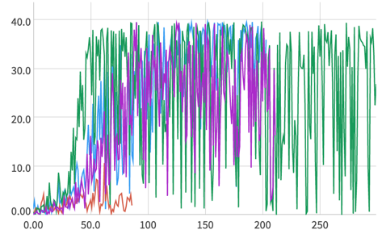

# Report

## Introduction
This report describes the implementation used to solve the reinforcement learning task. The exact details of the problem
are provided in the `README.md` file.

## Neural network architecture
To solve the problem, a DDPG was used. To add exploration to the model, a noise element was added to facilitate exporation.
The whole architecture consists of:
* actor network
* critic network  

which are described in detail below

### Actor Network

This network i responsible for picking the best action in a given state. Therefore, the network takes as input state
vector and outputs action vector. During my experiments I tried a couple of different sizes, but finally settled on the
following:

* Linear layer (state size=33 -> 128 neurons)
* Linear layer (128 neurons -> 128 neurons)
* Linear layer (128 neurons -> output neurons=4)

The final network is therefore smaller than the original implementation in the paper. Also, I did use `ReLU` and `BatchNorm1d`
layers in training. The only difference I made was not applying batch normalization to the raw input, as it wasn't very 
effective in my case. That being said, my experiments has shown that adding batchnorm while keeping network atchitecture costant
is very beneficial - the network achieve higher goals and the training is more stable

### Critic Network

Critic network was simillar to the one described in the paper - but again smaller: 

* Linear layer (state size=33 -> 128 neurons)
* Concatenating output with actions vector (128 + 4 = 132)
* Linear layer (132 neurons -> 128 neurons)
* Linear layer (128 neurons -> output neurons=4)

Simillar to the Actor Network, the only differences from the paper are smaller size and not using batchnorm on inputs. 
Alos, the original paper proposes using *L2 weight decay* for critic network's optimizer, but in my case that didn't provide 
any useful results.

### Training results, experiments

After settling on the number of neurons which are required to solve the problem, the key issue for me became the stability of
the learning process. The graph below shows average rewards for final experiments:

As clearly visible in the pictures, the reward for the last couple of epochs tend to fall close to 0 at times, which is why
the average reward stayed at aroud 28. Red line is quite a notable example - in this case I tried a very small replay
buffer with 100 000 size. Very small size caused learning to stop at very low values.

The final version used a much larger (`1e6`) size of the replay buffer. Also, in order to mitigate the jumps in the
learning proces, I implemented that Ornstein-Uhlenbeck noise should be added just to the first 50 epochs. The results 
of the learning process can be examined  [here](https://app.neptune.ai/wsz/RL-AgentCritic/e/RLAG-51/charts)

The plot for the final network show that as the rewards get larger, the learning process becomes more and more unstable.
I'm not sure why, but after 100 epochs, it seems that the variability in the rewards lowered, which lead to achieving 
an average reward of more than 30

## Noise

As in the source paper, I implemented using Ornstein-Uhlenbeck noise to give the agent a chance to explore the state space.
Although it was indeed helpful, I noticed that the stability of the process is quite poor while noise is on, which is why
I decided to use it for the firt 50 epochs only.

## Memory

Experience replay (without prioritization) was used to solve the problem. The buffer size used was 1e6 - the intuition was
that as the state space is large, a large buffer is required to collect more experiences which are valuable for the agent.

## Hyperparameters

The hyperparameters are stored in the `src.config.py` file. The final values were:
* Actor learning rate = `1e-3`
* Critic learning rate = `1e-3`
* Gamma = `0.9`
* Tau = `1e-2`
* Number of exporatory epochs (with Ornstein-Uhlenbeck noise) = 50
* Noise standard deviation = `0.01`
* Number of epochs = `300`
* Batch size = `256`

## Ideas for future developments
The project can be further developed by:
* implementing learning on the raw pixel data
* implementing prioritized experience replay
* training the agent on a 20 agent environment version
* experiment further with the model parameters to find the optimal values, providing more stable learning process
* check how the algorithm performs in different environments (this would not boost the model literally, but would
provide intuition regarding parameters and required model complexity)
* check other learning algorithms (such as A2C) to compare them in this specific environment